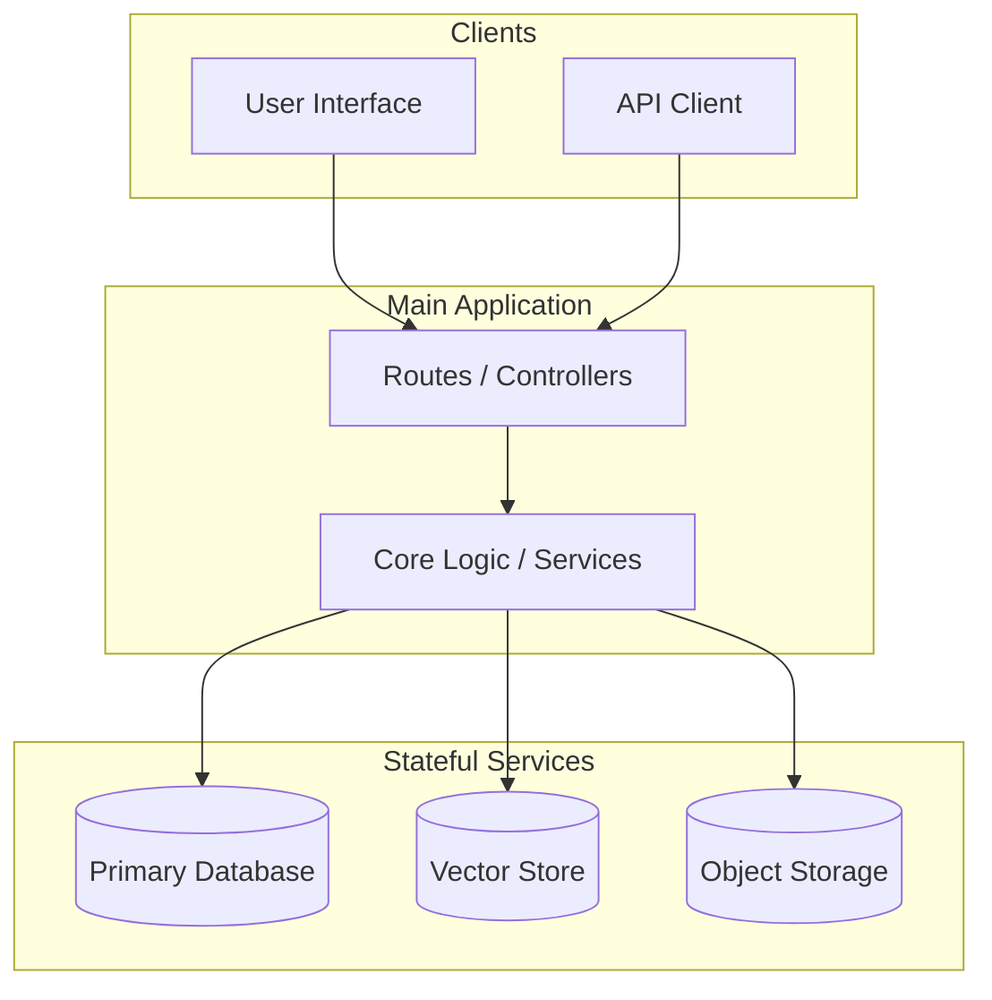

<!-- 
DOCUMENTATION TEMPLATE: Architecture
=====================================
Focus: Defining the structural design, component responsibilities, and system interactions.

I. AGENT EXECUTION PROTOCOL (INTERNAL GUIDANCE):
1. CONTEXT HARVESTING: Identify core application services, databases, messaging queues, and UI frameworks.
2. PLACEHOLDER RESOLUTION: Replace all [bracketed] strings with project-specific structural data.
3. PRUNING: Remove [OPTIONAL] sections or table rows if they do not match the project stack.
4. SURGICAL CLEANUP: Delete all italicized notes and this instruction block.

II. HUMAN CUSTOMIZATION GUIDE:
1. PLACEHOLDERS: Replace text within `[brackets]` with your specific technologies and design patterns.
2. TAILORING: Add or remove rows in the Architectural Style table based on your layering strategy.
3. VISUALS: Update the Mermaid flowchart syntax to reflect your actual data paths.
4. FINALIZATION: Delete all instructional text (in *italics*) before publishing.
-->

# Architecture

**[Project Title / Name]** is a **[e.g., single Python service with a separate background worker]**. It exposes **[e.g., FastAPI routes and a Gradio UI]**, uses **[e.g., a fine-tuned CLIP model]** for embeddings, stores vectors in **[e.g., Qdrant]**, stores binaries in **[e.g., MinIO]**, and uses **[e.g., Redis/RQ]** for durable background jobs.

## High-Level Diagram

*Provide a visual overview of how clients interact with services and storage.*

## Architectural Style

**[MANDATORY]**
*Explain the design pattern and layering strategy.*

| Layer | Responsibility |
|---|---|
| **API / UI** | [e.g., HTTP routes, request validation, UI components] |
| **Core Services** | [e.g., Business logic, model inference, orchestration] |
| **Storage Adapters** | [e.g., Database wrappers, object store clients] |

### Runtime Object Lifetime

**[OPTIONAL / RECOMMENDED]**
*Explain how stateful objects (clients, models, settings) are managed across the application lifecycle.*

## Component Responsibilities

### [Component 1 Name, e.g., FastAPI Application]
**[MANDATORY]**
*Detail the boundaries and responsibilities of this component (e.g., validation, auth, metrics).*

### [Component 2 Name, e.g., Background Worker]
**[OPTIONAL]**
*Detail secondary or background processes.*

## Deployment Shapes

### Local Development
*Describe the stack during local work (e.g., local process + Docker dependencies).*

### Production
*Describe the production topology (e.g., Docker Compose stack, Kubernetes pods).*

## Known Tradeoffs

**[RECOMMENDED]**
*Acknowledge any deliberate design decisions and their limitations (e.g., "Simplicity over extreme scalability").*

---

[Back to Documentation Index](README.md)

