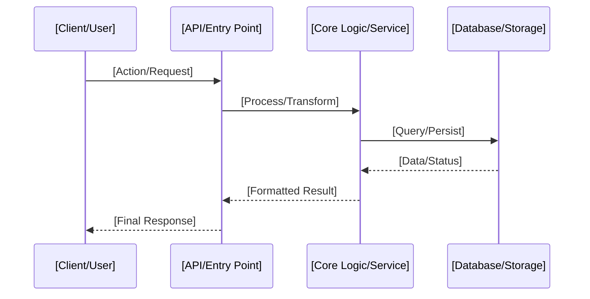

<!-- 
DOCUMENTATION TEMPLATE: Data Flows
==================================
Focus: Visualizing and describing the end-to-end journey of information.

I. AGENT EXECUTION PROTOCOL (INTERNAL GUIDANCE):
1. CONTEXT HARVESTING: Map request paths, background processing triggers, and telemetry collection points.
2. PLACEHOLDER RESOLUTION: Replace all [bracketed] strings with verified data movement details.
3. PRUNING: Remove flow categories (e.g., Background Processing) if not utilized by the project.
4. SURGICAL CLEANUP: Delete all italicized notes and this instruction block.

II. HUMAN CUSTOMIZATION GUIDE:
1. PLACEHOLDERS: Replace all text within `[brackets]` with your specific service and data labels.
2. TAILORING: Customize the Mermaid sequence diagram to match your specific API and logic layers.
3. FINALIZATION: Delete all instructional text (in *italics*) to maintain high documentation quality.
-->

# Data Flows

This document details the critical data paths for **[Project Title / Name]**, illustrating how information is processed, stored, and monitored.

## 1. Primary Request/Response Flow
*Describe the end-to-end journey of a standard user request.*

## 2. Background / Async Processing Flow
*Describe how tasks are handled outside the main request cycle (e.g., workers, queues).*

## 3. Telemetry and Monitoring Flow
*Explain how system metrics (e.g., health, performance) are collected and exposed.*

## 4. Storage Architecture
*Define the roles of different storage layers (e.g., Relational, Key-Value, Object Storage).*

---

[Back to Documentation Index](README.md)

