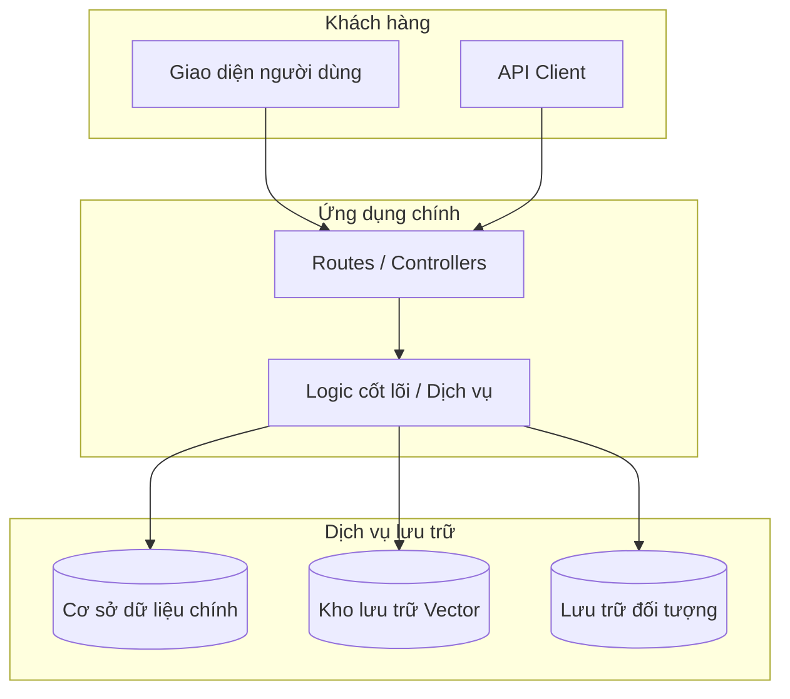

<!-- 
BẢN MẪU TÀI LIỆU: Kiến trúc hệ thống
===================================
Trọng tâm: Định nghĩa thiết kế cấu trúc, trách nhiệm thành phần và tương tác hệ thống.

I. GIAO THỨC THỰC THI CHO AGENT (DÀNH CHO AI):
1. THU THẬP NGỮ CẢNH: Xác định các dịch vụ ứng dụng cốt lõi, cơ sở dữ liệu, hàng đợi thông báo và framework giao diện.
2. ĐIỀN DỮ LIỆU: Thay thế tất cả chuỗi trong dấu ngoặc vuông `[ ]` bằng dữ liệu cấu trúc cụ thể của dự án.
3. TỐI ƯU HÓA: Loại bỏ các phần [TÙY CHỌN] hoặc các dòng trong bảng nếu chúng không khớp với stack công nghệ của dự án.
4. LÀM SẠCH: Xóa bỏ tất cả ghi chú in nghiêng và khối hướng dẫn này.

II. HƯỚNG DẪN TÙY BIẾN CHO NGƯỜI DÙNG:
1. ĐIỀN THÔNG TIN: Thay thế văn bản trong dấu ngoặc vuông `[ ]` bằng các công nghệ và mẫu thiết kế cụ thể của bạn.
2. ĐIỀU CHỈNH: Thêm hoặc bớt các dòng trong bảng Phong cách Kiến trúc dựa trên chiến lược phân lớp của bạn.
3. TRỰC QUAN HÓA: Cập nhật cú pháp sơ đồ Mermaid để phản ánh chính xác các luồng dữ liệu thực tế.
4. HOÀN THIỆN: Xóa toàn bộ văn bản hướng dẫn (chữ *in nghiêng*) trước khi xuất bản.
-->

# Kiến trúc hệ thống

**[Tên Dự án]** là một hệ thống **[ví dụ: dịch vụ Python đơn lẻ với worker chạy ngầm tách biệt]**. Dự án cung cấp **[ví dụ: các API FastAPI và giao diện Gradio]**, sử dụng **[ví dụ: mô hình CLIP đã được tinh chỉnh]** để tạo embedding, lưu trữ vector tại **[ví dụ: Qdrant]**, lưu trữ dữ liệu nhị phân tại **[ví dụ: MinIO]**, và sử dụng **[ví dụ: Redis/RQ]** để quản lý các tác vụ nền bền vững.

## Sơ đồ cấp cao

*Cung cấp cái nhìn tổng quan về cách khách hàng tương tác với các dịch vụ và lưu trữ.*

## Phong cách kiến trúc

**[BẮT BUỘC]**
*Giải thích mẫu thiết kế và chiến lược phân lớp.*

| Lớp | Trách nhiệm |
|---|---|
| **API / UI** | [ví dụ: HTTP routes, xác thực yêu cầu, các thành phần giao diện] |
| **Dịch vụ cốt lõi** | [ví dụ: Logic nghiệp vụ, suy luận mô hình, điều phối hệ thống] |
| **Bộ chuyển đổi lưu trữ** | [ví dụ: Các wrapper cho cơ sở dữ liệu, client lưu trữ đối tượng] |

### Vòng đời đối tượng thực thi (Runtime)

**[TÙY CHỌN / KHUYẾN NGHỊ]**
*Giải thích cách quản lý các đối tượng có trạng thái (clients, models, settings) trong suốt vòng đời của ứng dụng.*

## Trách nhiệm của các thành phần

### [Tên thành phần 1, ví dụ: Ứng dụng FastAPI]
**[BẮT BUỘC]**
*Chi tiết ranh giới và trách nhiệm của thành phần này (ví dụ: xác thực, phân quyền, số liệu).*

### [Tên thành phần 2, ví dụ: Background Worker]
**[TÙY CHỌN]**
*Chi tiết về các tiến trình phụ hoặc tiến trình chạy ngầm.*

## Mô hình triển khai

### Phát triển cục bộ
*Mô tả stack khi làm việc tại máy cá nhân (ví dụ: tiến trình cục bộ + các phụ thuộc chạy bằng Docker).*

### Triển khai thực tế (Production)
*Mô tả cấu trúc triển khai thực tế (ví dụ: stack Docker Compose, Kubernetes pods).*

## Các đánh đổi đã biết (Tradeoffs)

**[KHUYẾN NGHỊ]**
*Ghi nhận các quyết định thiết kế có chủ đích và giới hạn của chúng (ví dụ: "Ưu tiên sự đơn giản thay vì khả năng mở rộng cực hạn").*

---

[Quay lại Danh mục Tài liệu](README.md)

