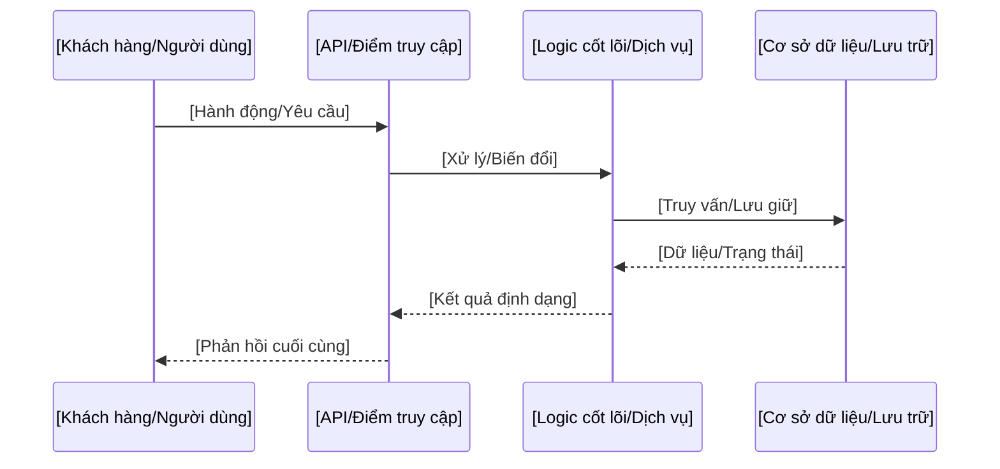

<!-- 
BẢN MẪU TÀI LIỆU: Luồng dữ liệu
==============================
Trọng tâm: Trực quan hóa và mô tả hành trình từ đầu đến cuối của thông tin.

I. GIAO THỨC THỰC THI CHO AGENT (DÀNH CHO AI):
1. THU THẬP NGỮ CẢNH: Ánh xạ lộ trình yêu cầu, các trigger xử lý nền và các điểm thu thập số liệu đo lường.
2. ĐIỀN DỮ LIỆU: Thay thế tất cả chuỗi trong dấu ngoặc vuông `[ ]` bằng các chi tiết di chuyển dữ liệu đã được xác thực.
3. TỐI ƯU HÓA: Loại bỏ các danh mục luồng (ví dụ: Xử lý nền) nếu dự án không sử dụng.
4. LÀM SẠCH: Xóa bỏ tất cả ghi chú in nghiêng và khối hướng dẫn này.

II. HƯỚNG DẪN TÙY BIẾN CHO NGƯỜI DÙNG:
1. ĐIỀN THÔNG TIN: Thay thế văn bản trong dấu ngoặc vuông `[ ]` bằng nhãn dịch vụ và dữ liệu cụ thể của bạn.
2. ĐIỀU CHỈNH: Tùy chỉnh sơ đồ trình tự Mermaid để khớp với các lớp API và logic cụ thể của bạn.
3. HOÀN THIỆN: Xóa toàn bộ văn bản hướng dẫn (chữ *in nghiêng*) để duy trì chất lượng tài liệu cao.
-->

# Luồng dữ liệu

Tài liệu này chi tiết các lộ trình dữ liệu quan trọng của **[Tên Dự án]**, minh họa cách thông tin được xử lý, lưu trữ và giám sát.

## 1. Luồng Yêu cầu/Phản hồi Chính
*Mô tả hành trình từ đầu đến cuối của một yêu cầu tiêu chuẩn từ người dùng.*

## 2. Luồng Xử lý Nền / Bất đồng bộ
*Mô tả cách các tác vụ được xử lý bên ngoài chu trình yêu cầu chính (ví dụ: workers, hàng đợi).*

## 3. Luồng Đo lường và Giám sát
*Giải thích cách các số liệu hệ thống (ví dụ: sức khỏe, hiệu năng) được thu thập và hiển thị.*

## 4. Kiến trúc Lưu trữ
*Xác định vai trò của các lớp lưu trữ khác nhau (ví dụ: Quan hệ, Key-Value, Lưu trữ đối tượng).*

---

[Quay lại Danh mục Tài liệu](README.md)

